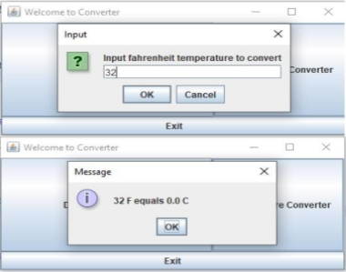

**Assignment 3        GUI & Polymorphism** 

Before attempting this project, be sure you have completed all the reading assignments, non- graded exercises, discussions, and assignments to date. 

**Design and implement Java program as follows:** 

1) Implement converter class hierarchy as follows: 
1. **Converter** class which includes: 
   1. Private attribute for input of data type double 
   1. Default constructor with no parameter which sets input to Double.NaN 
   1. Overloaded constructor with input for parameter 
   1. Get and set methods for input attribute 
   1. Method convert() which returns input value 
1. **TemperatureConverter** class which is a child of Converter and 

includes: 

- Constructors which call parent constructors 
- Overridden convert() method to convert input (Fahrenheit temperature) to Celsius and returns the value. If the instance has no input value, it should return Double.NaN 
- Use the following formula for conversion:  C = ((F-32)\*5)/9 
3. DistanceConverter class which is a child of Converter and 

includes: 

- Constructors which call parent constructors 
- Overridden convert() method to convert input (distance in miles) to distance in kilometers and returns the value. If the instance has no input value, it should return Double.NaN 
4. Use the following formula for conversion:  KM = M \* 1.609 
2) Implement GUIConverter class using JFrame and JPanel as follows: 
1. GUI will have 3 buttons: “Distance Converter”, “Temperature Converter”, and “Exit”. 

2. When user clicks Exit, the program will terminate 
3. When user clicks Distance Converter, an input dialog will pop up where user can type value and click OK: 

4. Once user clicks OK, message dialog will pop up: 

5. When user clicks on Temperature button, an input dialog will pop up to input value and then when clicks OK, the message dialog with pop up with converted result:

6. **SUGGESTIONS**: 
- For the input dialog you can use JOptionPane.showInputDialog 
- The ActionListener for each Converter button should create the appropriate Converter child instance, set the input, and call its convert() method 
- For the pop up with converted value you can use JOptionPane.showMessageDialog 

**Style and Documentation:** 

Make sure your Java program is using the recommended style such as: 

- Javadoc comment up front with your name as author, date, and brief purpose of the program 
- Comments for variables and blocks of code to describe major functionality 
- Meaningful variable names and prompts 
- Class names are written in upper CamelCase 
- Constants are written in All Capitals 
- Use proper spacing and empty lines to make code human readable 
